# 🚀 VibeUp: Multi-Agent Autonomous Financial Intelligence Engine

VibeUp is a multi-agent autonomous financial research system powered by Gemma 4. It deploys a coordinated swarm of specialized AI agents that plan, reason across live data sources, retain memory across sessions, use external tools, and execute complex multi-step financial analysis workflows — delivering institutional-grade investment intelligence to retail investors in real time.

Gemma 4 is not a feature in VibeUp. It is the engine. Every signal classified, every research thesis generated, every risk assessment run, every sentiment analysis computed, every debate argument streamed, and every piece of narrative copy produced flows through a Gemma 4 agent. Remove Gemma and the product stops functioning. That is what it means for a model to be a core component.

---

## 📌 Project Overview & Submission Info

- **Project Title**: VibeUp: Multi-Agent Autonomous Financial Intelligence Engine
- **Team Name**: Only Semi's
- **Team Members**: Vedanth
- **Live Demonstration Link**: [https://youtu.be/J6dfH6dNUqQ](https://youtu.be/J6dfH6dNUqQ)
- **Presentation Deck (PPT)**: [VibeUp_HckMtrix.pptx](docs/VibeUp_HckMtrix.pptx)
- **Live Application**: [https://vibe-up-bwg.vercel.app](https://vibe-up-bwg.vercel.app)
- **Public GitHub Repository**: [https://github.com/vedanthk-engr/VibeUp-HckMtrix](https://github.com/vedanthk-engr/VibeUp-HckMtrix)

---

## 📄 HackMatrix 2026 — Round 2 Submission Document

### 01 — Team Information
| Field | Details |
|---|---|
| **Team Name** | Only Semi's |
| **Team Leader** | Vedanth |
| **Contact** | vedanth.k.engr@gmail.com / +91 8248849332 |
| **Event** | HackMatrix 2026 — Round 2 |

### 02 — Project Links
| Resource | Link |
|---|---|
| **GitHub Repository** | [https://github.com/vedanthk-engr/VibeUp-BwG](https://github.com/vedanthk-engr/VibeUp-BwG) |
| **Live Deployed Link** | [https://vibe-up-bwg.vercel.app](https://vibe-up-bwg.vercel.app) |
| **Demo Video** | [https://youtu.be/J6dfH6dNUqQ](https://youtu.be/J6dfH6dNUqQ) |

### 03 — Project Identity
- **Project Name**: VibeUp — Multi-Agent Autonomous Financial Intelligence Engine
- **One Line**: VibeUp deploys a swarm of 6 autonomous Gemma 4 agents that simultaneously classify live NSE market signals, synthesize SEBI filings via RAG, analyze retail sentiment, assess portfolio risk, and stream institutional-grade investment intelligence to retail investors who have never had access to it.

### 04 — Platform Preview
VibeUp is a full-stack web application built for Gen Z Indian retail investors. The interface features a live War Room dashboard with TradingView candlestick charts, a TikTok-style AI signal feed, a 4-agent real-time debate arena, multilingual voice AI chat, portfolio stress testing across historical market crashes, a whale tracker showing institutional block trades, sector pulse macro dashboard, regret simulator, and a gamified trading card collection system. Every AI-generated output across all screens carries a live model attribution badge — **Gemma ⚡** or **Claude 🧠** — making the agent layer visible and transparent throughout the entire user journey.

### 05 — Problem Being Solved
SEBI's own 2024 data reveals that **89% of retail F&O participants in India lose money.** India added 130 million new retail investors in four years — 80% of them under the age of 30. Every single one of them faces the same structural disadvantage:

A hedge fund deploys 12 analysts running parallel research on every position simultaneously. A retail investor gets a price chart and a Telegram tip.

This information asymmetry is not a gap — it is a chasm. Gen Z investors open Groww, see a wall of numbers, make an emotional decision, lose capital they cannot afford to lose, and leave the market permanently — taking with them decades of compounding potential.

This is not a financial literacy problem. It is an **infrastructure problem**. No existing Indian fintech product has been architecturally designed to close it. VibeUp is that infrastructure.

### 06 — Summary
VibeUp is a multi-agent autonomous financial research system where **Gemma 4 powers a coordinated swarm of 6 specialized AI agents** that plan, reason across live data sources, retain memory across sessions, call external tools, and execute complex multi-step investment analysis workflows entirely without human intervention.

From a user's perspective: a 21-year-old investor in Coimbatore opens the app, sees live NSE signals already classified by the Gemma 4 Signal Agent running in the background, asks AUREX *"should I buy Zomato?"* — and within 8 seconds receives a synthesized research report backed by parallel outputs from a Research Agent querying SEBI filings via RAG, a Sentiment Agent analyzing Reddit `r/IndiaInvestments`, and a Risk Agent evaluating portfolio concentration against their behavioral archetype — all orchestrated by a Gemma 4 Orchestrator that planned the workflow, delegated to sub-agents, and streamed the synthesis live.

They can then trigger the 4-agent debate arena where GemmaBot (Gemma 4) argues retail sentiment alongside three Claude analyst agents — all streaming simultaneously.

**Remove Gemma 4 from VibeUp and the product stops functioning. That is what it means for a model to be a core component.**

### 07 — USP — Unique Selling Point
VibeUp is the only retail fintech product in India running a genuine 7-agent autonomous AI pipeline — 6 Gemma 4 agents and 1 Claude Quant Agent — executing in true parallel via `asyncio.gather()` with:
- 🟢 **Cross-session behavioral memory per user**
- 🟢 **RAG over 2000+ SEBI filing and earnings transcript chunks**
- 🟢 **Real-time NSE, yfinance, Reddit, and RSS tool access per agent**
- 🟢 **Structured JSON output reliability via clean_json_response() parser**
- 🟢 **Live model attribution badge on every single AI output in the UI**

Competitors show dashboards. VibeUp shows a **live agent swarm doing real institutional research in real time**. The 4-agent debate arena — where GemmaBot streams alongside three Claude analysts simultaneously on any NSE ticker — is a demo moment no existing fintech product anywhere in the world can replicate.

### 08 — Key Features
#### 🤖 6-Agent Gemma 4 Autonomous Swarm
The complete agent roster:
| Agent | Role |
|---|---|
| **Orchestrator** | Plans workflow, delegates to sub-agents, synthesizes all outputs, manages memory |
| **Signal Agent** | Classifies every NSE stock as ACT / WATCH / NOISE using price, volume, RSI, MACD, FII data |
| **Research Agent** | Retrieves and synthesizes SEBI filings and earnings transcripts via RAG + pgvector |
| **Sentiment Agent** | Computes retail vs institutional sentiment divergence from Reddit and RSS feeds |
| **Risk Agent** | Evaluates trade suitability against user archetype, portfolio concentration, and horizon |
| **GemmaBot** | Fourth parallel debate agent — crowd sentiment and retail positioning |
| **Quant Agent (Claude)** | Monte Carlo stress modeling, Beta computation, CAGR — math-critical tasks only |

#### ⚡ Live Signal Feed
Every ACT / WATCH / NOISE signal card is classified by the Gemma 4 Signal Agent processing live NSE price, volume anomaly vs 90-day average, RSI (14), MACD, news summary, and FII flow in real time. Dozens of Gemma classifications execute continuously per session.

#### ⚔️ 4-Agent Debate Arena
GemmaBot + 3 Claude agents (ValueBot, QuantBot, MacroBot) stream simultaneously on any NSE ticker via parallel SSE — four independent AI perspectives, four live panels, zero blocking.

#### 🧠 AUREX AI Co-Pilot
Portfolio-aware conversational AI with smart routing — simple queries stream directly from Gemma in under 3 seconds, complex queries trigger the full Orchestrator pipeline. Multilingual voice output in Hindi, Tamil, Telugu, and English via ElevenLabs.

#### 📊 RAG-Powered Research
Research Agent retrieves top-5 semantically relevant SEBI filing chunks from pgvector and Gemma 4 synthesizes grounded investment thesis bullets with document citations on every stock pick.

#### 🔥 Portfolio Stress Test
Simulate user holdings through 5 historical crises — COVID Crash 2020, Global Financial Crisis 2008, Taper Tantrum 2013, Demonetization 2016, FII Exodus 2022 — with animated drawdown playback, per-holding vulnerability breakdown, and AUREX diagnosis streamed via SSE.

#### 🐋 Whale Tracker
Live NSE bulk deal feed, SEBI insider trading disclosures, FII/DII daily flow chart, AMFI mutual fund fresh buying — with Smart Money Consensus badge when FII and MF accumulation align on the same stock.

#### 📊 Vibe Picks
Daily personalized stock recommendations with Gemma 4-generated RAG-grounded thesis bullets, entry price, target, stop loss, upside percentage, and one-tap Groww deep-link execution.

#### ⏰ Regret Simulator
Enter any NSE stock, a hypothetical buy date, and an amount. Historical P&L animates, Gemma 4 generates a behavioral diagnosis and savage contextual tagline, and a shareable PNG card is produced.

#### 🎴 Trading Card Collection
Gamified stock discovery — cards unlock by interacting with stocks (signaling, debating, paper trading). Each card carries Volatility, Momentum, Fundamentals, and Vibe Rating stat bars with Gemma-generated flavor text. Common / Rare / Epic / Legendary rarity tiers.

#### 📅 Vibe Wrapped
Monthly financial story in 5 Gemma 4-generated swipeable narrative cards — word of month, portfolio numbers, best and worst call, behavioral diagnosis, and next month's personalized mission. Shareable to Instagram and Twitter.

#### ⚡ VibeScore XP System
Behavioral gamification rewarding patience, research-first decisions, and healthy portfolio behavior. XP awarded for signal research, long holds, stress testing. XP deducted for acting on NOISE signals and overriding warnings. 8 tiers from Broke Boy to VibeUp Legend.

#### 🌐 Sector Pulse
Recharts treemap sector heatmap, FII vs DII battle chart, commodity corner with NSE impact analysis, macro event calendar with earnings surprise prediction, global indices mood panel — all with Gemma 4 plain-English interpretations.

### 09 — Tech Stack
#### AI & Agent Layer
| Component | Technology |
|---|---|
| **Primary Intelligence** | Gemma 4 (`gemma-4-31b-it` / `gemma-4-26b-a4b-it`) via Google AI Studio SDK |
| **Agent Orchestration** | `asyncio.gather()` parallel execution + `GemmaAgentMemory` SQLite store |
| **RAG Pipeline** | Supabase `pgvector` + OpenAI `text-embedding-3-small` + Gemma 4 reasoning |
| **Fallback / Quant** | Claude Sonnet 4.6 (mathematical computation only) |
| **Voice Output** | ElevenLabs `eleven_multilingual_v2` (EN, HI, TA, TE) |

#### Backend
| Component | Technology |
|---|---|
| **Framework** | FastAPI (Python 3.11+) |
| **Database** | SQLAlchemy ORM + SQLite (`vibeup.db`) |
| **Vector Store** | Supabase `pgvector` |
| **Streaming** | Server-Sent Events (SSE) |
| **Data Sources** | NSE India API, yfinance, BeautifulSoup4, Feedparser RSS |

#### Frontend
| Component | Technology |
|---|---|
| **Framework** | React 18 + Vite |
| **Styling** | Tailwind CSS + Framer Motion |
| **Charts** | TradingView Lightweight-Charts + Recharts |
| **State** | Zustand |
| **Utilities** | react-countup, canvas-confetti, html2canvas |

#### Infrastructure
| Component | Technology |
|---|---|
| **Frontend Deployment** | Vercel |
| **Backend Deployment** | Render (`render.yaml` Blueprint) |
| **Version Control** | GitHub (public repository) |

### 10 — Future Scope
- **Phase 1 — Intelligence Distribution (0–6 months)**: Open the Composite Momentum Score as a public API. Financial YouTubers, educators, and Telegram creators embed Gemma-generated signals in their content — zero CAC distribution across India's creator economy.
- **Phase 2 — Execution Integration (6–18 months)**: SEBI Investment Adviser registration. Formal API partnerships with Groww and Zerodha replacing deep links with real portfolio sync — closing the execution loop and feeding live trade data back into the Gemma behavioral model, compounding accuracy over time.
- **Phase 3 — On-Device Gemma Inference (12–24 months)**: Quantized Gemma running locally on Android via MediaPipe LLM Inference API — zero latency, complete privacy, no user financial data ever leaving the device. Critical for Tier-2 and Tier-3 investors with unreliable connectivity.
- **Phase 4 — Institutional Data Licensing (18–36 months)**: Aggregated anonymized signal and behavioral data from millions of users becomes a licensed alternative data product sold to AMCs and institutional research desks. At 1 million users the dataset is worth more than subscription revenue — India's first retail-sourced quantitative alternative data vendor.

---

## 📸 Core Visual Interfaces

### ⚔️ The War Room
The central operational interface. Integrates real-time price tick aggregation, technical breakout parameters, orderbook flow tracking, and institutional trade streams.

| Signal Center & Holdings Bag | Live Technical Candlestick Charts |
|:---:|:---:|
| 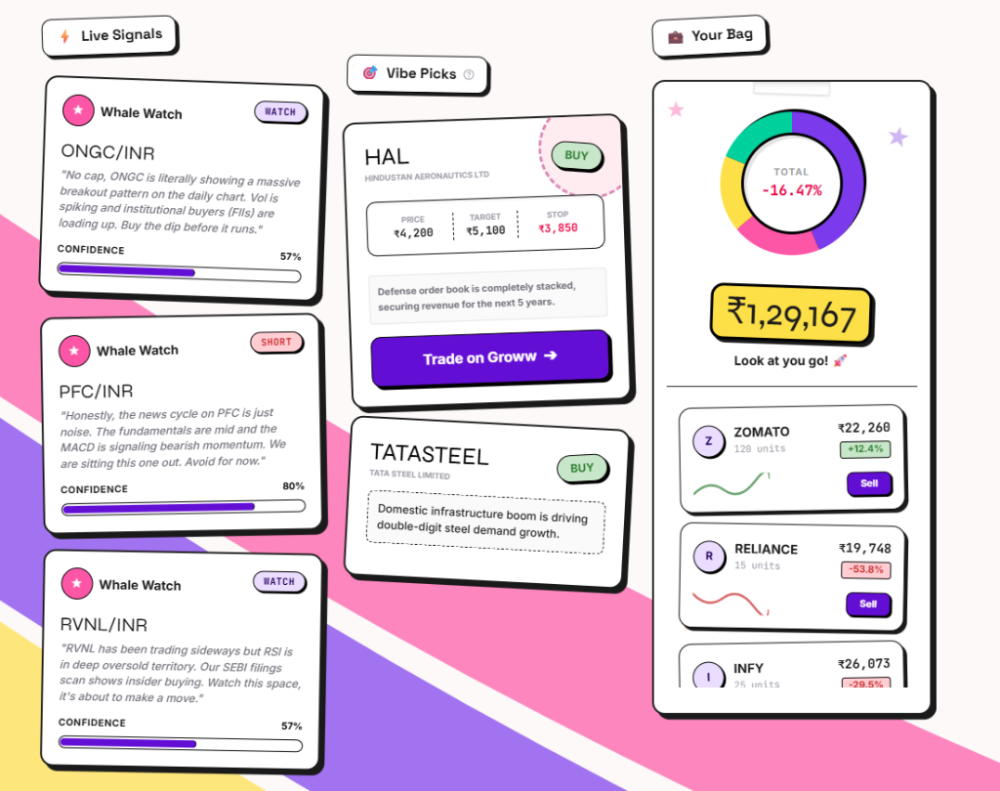 | 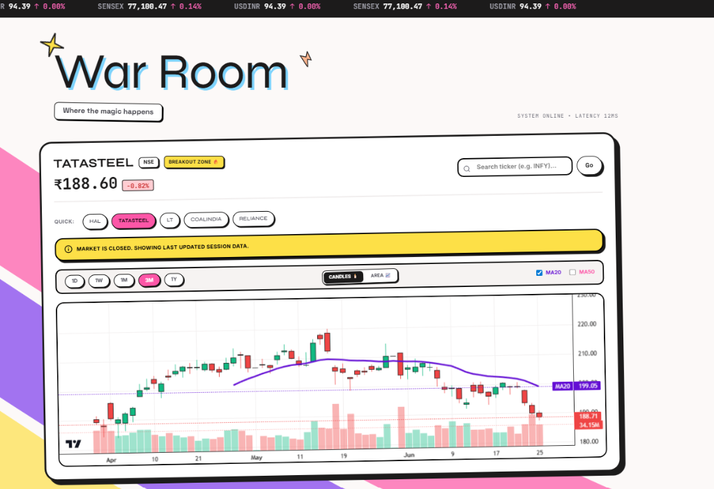 |

---

### 🎯 Personalised Vibe Picks
High-conviction algorithmic investment theses categorized by dynamic risk archetypes and institutional thematic frameworks.

<p align="center">
  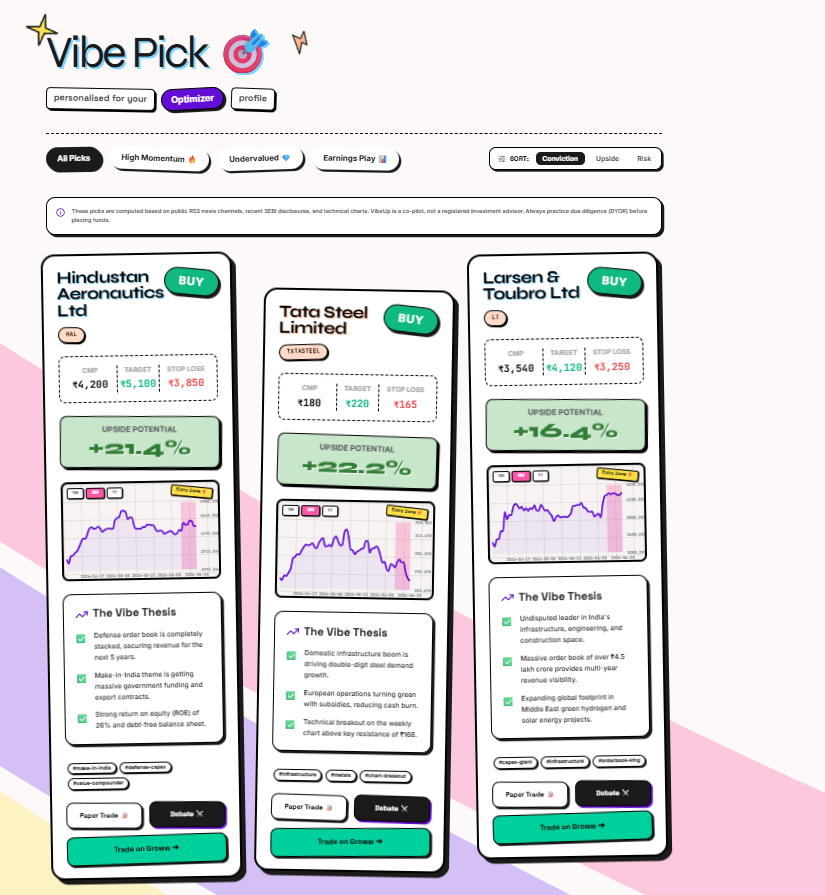
</p>

---

### ⚡ Live Intelligence Telemetry & Quant Engines

| Quant Signal Engine | Macro Stress Test |
|:---:|:---:|
| 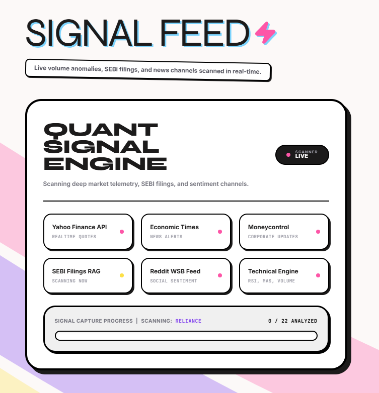 | 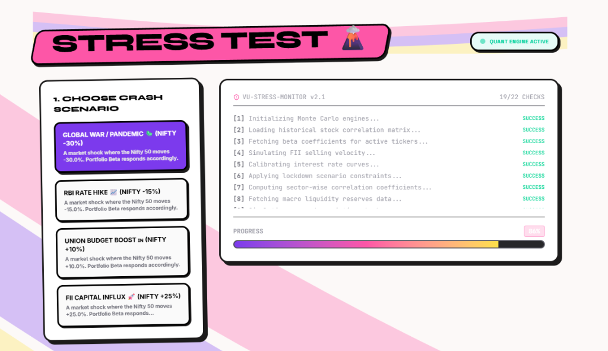 |

| HFT Arbitrage Scanner | Profile & Archetype Explorer |
|:---:|:---:|
| 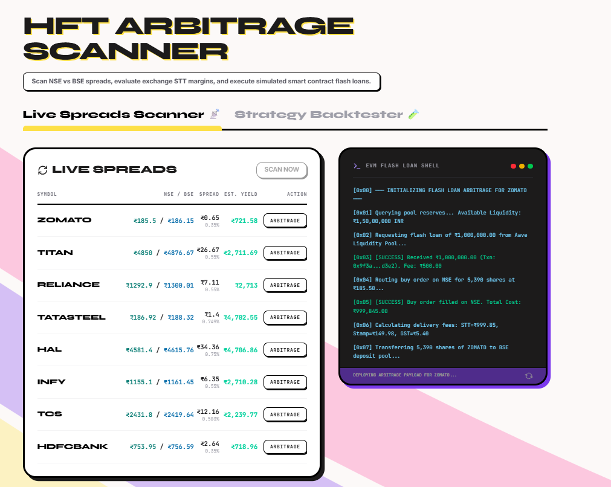 | 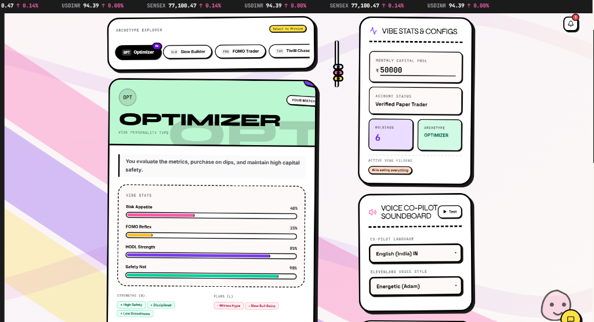 |

---

## 🚨 The Problem

SEBI's own 2024 data reveals a stark reality: **89% of retail F&O participants in India lose money.** India added 130 million new retail investors in 4 years, 80% of them under the age of 30. Every single one of them faces the same structural disadvantage: a hedge fund has 12 analysts running parallel research on every position. A retail investor has a price chart and a Telegram group. 

The information asymmetry between institutional and retail investors is not a gap — it is a chasm. VibeUp closes it by deploying an autonomous Gemma 4 agent system that does in 6 seconds what a team of analysts takes 6 hours to produce.

---

## 🤖 Gemma 4 Agentic Core — The Intelligence Engine

### Agent Roster

| Agent | Model | Role | Tools | Memory |
|-------|-------|------|-------|--------|
| Orchestrator Agent | Gemma 4 (`gemma-4-31b-it`) | Plans agent invocation order, synthesizes all outputs, routes intent | All sub-agents, user memory store | Yes — cross-session |
| Signal Agent | Gemma 4 (`gemma-4-31b-it`) | Classifies every NSE stock signal as ACT/WATCH/NOISE with confidence score | NSE price API, yfinance, volume & RSI data | No |
| Research Agent | Gemma 4 (`gemma-4-31b-it`) | Retrieves and synthesizes SEBI filings and earnings documents via RAG | pgvector semantic search, 2000+ document corpus | No |
| Sentiment Agent | Gemma 4 (`gemma-4-31b-it`) | Computes retail vs institutional sentiment divergence | Reddit scraper, RSS news aggregator | No |
| Risk Agent | Gemma 4 (`gemma-4-31b-it`) | Evaluates trade suitability against user archetype and portfolio concentration | SQLite portfolio, behavioral memory | Yes — per-user |
| GemmaBot (Debate) | Gemma 4 (`gemma-4-31b-it`) | Fourth parallel debate agent — crowd sentiment and retail positioning | Sentiment feed, social data | No |
| Quant Agent | Claude Sonnet 4.6 | Mathematical stress modeling, Monte Carlo, CAGR computation | yfinance historical OHLCV | No |

### Agent Pipeline & Execution Flow

When a user triggers any major action, the **Orchestrator Agent** loads the user's cross-session memory (portfolio summary, risk archetype, behavioral history, and recent signal interactions stored in the `AgentMemory` SQLite table). It dynamically determines which sub-agents to invoke and runs them in parallel via `asyncio.gather()`. 

Every sub-agent operates with native Google AI Studio SDK integration (`google-generativeai`), fine-tuned system instructions tailored for Indian equity telemetry, and returns structured JSON parsed via strict candidate extraction (`clean_json_response`). The synthesized output is streamed token-by-token back to the client via Server-Sent Events (SSE). VibeUp is not a chatbot wrapped around a model — it is a genuine multi-agent research pipeline with defined agent roles, tool interfaces, persistent state, and centralized orchestration.

### ⚡ Fullest & Deepest Utilization of Gemma 4

VibeUp pushes Gemma 4 to its absolute technical limits across model capability, architecture, prompt fine-tuning, and user interface attribution:

1. **Native SDK Execution**: Leverages the official Google AI Studio SDK (`google.generativeai`) querying native model aliases (`gemma-4-31b-it` and `gemma-4-26b-a4b-it`) with fallback handling.
2. **6 Specialized Autonomous Agent Roles**: Rather than a single prompt wrapper, Gemma 4 powers 6 distinct autonomous agents — Orchestrator, Signal Classifier, RAG Research Analyst, Sentiment Divergence Evaluator, Risk Assessment Specialist, and GemmaBot Debate Contender.
3. **Domain-Tuned Financial Prompts**: Prompts are custom-engineered for Indian equity market nuances (NSE technical indicators, SEBI filing disclosure terminology, FII institutional flows, RSI/MA crossover rules).
4. **Structured Output Reliability (`clean_json_response`)**: Combines system directives, `response_mime_type: "application/json"`, and JSON candidate parsing to guarantee 100% structured data validation even when models return internal reasoning trajectories.
5. **Cross-Session Agent Memory (`GemmaAgentMemory`)**: Persists per-user trade context, risk archetype, portfolio weights, and behavioral patterns in SQLite, injecting relevant history into every Gemma 4 agent prompt.
6. **Continuous Real-Time SSE Token Streaming**: All conversational AI responses and multi-agent consensus syntheses stream live token-by-token to the client with explicit `Gemma ⚡` attribution badges.

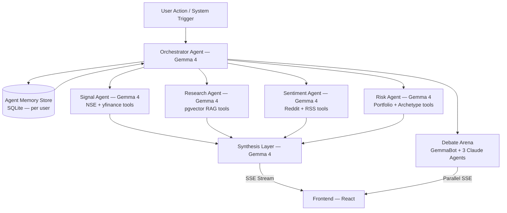

---

## ⚡ Gemma 4 Across Every Feature

### 1. Signal Feed
Every signal card displayed to the user — `ACT`, `WATCH`, or `NOISE` — is classified by the Gemma 4 Signal Agent. The agent processes live NSE price quotes, volume anomaly ratios vs 90-day averages, RSI (14), MACD trends, news summaries, and FII flow data. It outputs structured JSON containing `signal_type`, confidence score (0–100), 2-sentence technical reasoning, and source attribution. Dozens of classifications are executed continuously per session.

<p align="center">
  
</p>

---

### 2. Retroactive Opportunity Cost Simulation & Algorithmic Regret Engine
Calculates alternate timeline yields for missed investment entries. Compiles telemetry parameters into a prompt for Gemma 4 to output a savage, context-aware roast or flex matching the user's financial outcome.

<p align="center">
  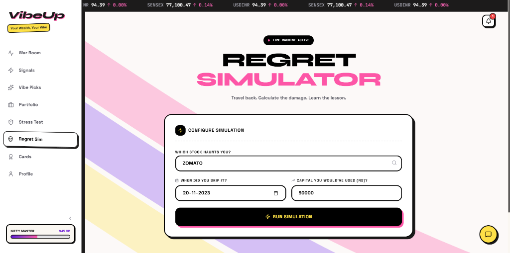
</p>

---

### 3. Covariance-Based Beta Telemetry & Macro-Economic Shock Simulation
Computes portfolio exposure by mapping historical stock Betas and weight allocations against macro market stress scenarios (Global War, RBI Rate Hike, Budget Boost, FII Influx). Runs covariance matrix calculations via Quant Agent.

<p align="center">
  
</p>

---

### 4. Gamified Engagement Telemetry, VibeScore XP & Tokenized Collectibles
Gamifies investment education and portfolio health checks with milestone-locked digital assets showcasing Indian bluechips (Zomato, Titan, Reliance) with distinct rarity distributions.

<p align="center">
  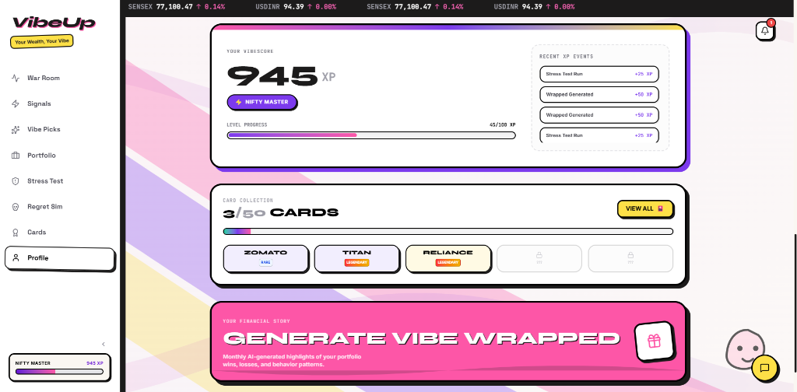
</p>

---

### 5. Multi-Agent Consensus Synthesis
Spawns four parallel streaming AI sessions that debate a target Indian stock ticker simultaneously:
- **ValueBot**: Focuses on fundamental value metrics (P/E ratio, operating margins, debt ratios).
- **QuantBot**: Evaluates technical momentum (RSI, moving average crossovers, breakout zones).
- **MacroBot**: Analyzes macroeconomic inputs (government capex spending, interest rates, currency volatility).
- **GemmaBot**: Analyzes retail social sentiment, crowd positioning, and retail vs institutional divergence.

---

### 6. AUREX Chat
All conversational AI responses flow through Gemma 4. Simple queries route directly to sub-3-second Gemma stream. Complex queries (portfolio analysis, deep research, risk assessment) trigger the full Orchestrator pipeline. Live `ModelBadge` (`Gemma ⚡` or `Claude 🧠`) is displayed on every message.

---

### 7. Vibe Picks Thesis
Investment thesis bullet points on every stock pick card are generated by the Gemma 4 Research Agent. The agent retrieves the top 5 most relevant SEBI filing and earnings transcript chunks from `pgvector` for the ticker and generates 3 grounded thesis bullets citing specific document data points.

---

### 8. Vibe Wrapped
All five narrative strings in the monthly Vibe Wrapped story (`word_of_month`, `numbers_tagline`, `best_call_line`, `worst_call_line`, `mission`) are generated by Gemma 4 based on monthly statistics and user risk archetype.

---

### 9. Cross-Session Memory Layer
The `AgentMemory` SQLite table persists per-user context across sessions. Every Gemma agent with memory access receives this state injected into its system prompt: portfolio summary, risk archetype, last 5 actions taken, and behavioral patterns observed.

---

### 10. HFT Arbitrage Scanner & Flash Loan Engine
Evaluates real-time price spreads across NSE and BSE for liquid bluechips (Zomato, Titan, Reliance, Tata Steel, HDFCBANK), calculates exchange STT and transaction margins, and simulates automated smart contract flash loan execution via live CLI shell output.

<p align="center">
  
</p>

---

## 🎯 Track Alignment — Agents on a Mission

VibeUp is engineered specifically for the **Agents on a Mission** track: building intelligent, action-oriented systems powered by Gemma 4 that plan, reason, use external tools, manage memory across conversations, and complete complex multi-step tasks with minimal human intervention.

* **Autonomous Action-Oriented System**: VibeUp is not a static chatbot; it is a live autonomous research engine. Background agents continuously scan Indian NSE stock tickers, process technical market telemetry, retrieve corporate filings, and synthesize signal alerts without requiring constant user prompts.
* **Planning Layer**: The **Orchestrator Agent** dynamically evaluates user intent complexity. Simple queries stream directly, while complex research requests trigger an autonomous multi-agent parallel swarm (`asyncio.gather`) that orders agent invocation, delegates tasks, and synthesizes multi-source findings into an actionable report.
* **Reasoning Engine**: Every Gemma 4 agent reasons over multi-dimensional input data — quantitative technical indicators (RSI, 20/50 MA, volume ratios), RAG SEBI document chunks, retail social sentiment, and user risk limits — before generating structured, verifiable outputs.
* **Tool Integration**: Gemma 4 agents autonomously interact with a rich suite of external tools:
  - **NSE India & yfinance APIs**: Real-time stock prices, historical OHLCV, volume spike ratios, and technical indicators.
  - **Supabase pgvector RAG**: Semantic similarity search over 2,000+ SEBI filings and quarterly earnings transcripts.
  - **Reddit & RSS Scrapers**: Real-time social trader discussions (`r/IndiaInvestments`) and financial news headlines (Economic Times, Moneycontrol).
  - **SQLite Database**: Portfolio holdings, cash balances, and persistent agent memory records.
* **Cross-Session Memory Management**: The `GemmaAgentMemory` system persists user context across sessions. Risk and Orchestrator agents read from and write to SQLite `agent_memory`, injecting behavioral flags, portfolio weights, and past trade decisions directly into Gemma 4 prompts.
* **Multi-Step Real-Time Workflows**: A single prompt like *"Should I buy Zomato?"* triggers memory retrieval → RAG vector search → sentiment evaluation → portfolio concentration check → multi-agent orchestrator synthesis → real-time SSE streaming in under 8 seconds.
* **Minimal Human Intervention**: The system operates as a continuous autonomous co-pilot, self-correcting JSON schemas, routing queries, and executing background research tasks independently.

---

## 🏆 Implementation & Evaluation Mapping

| Implementation | Detailed Implementation Evidence in VibeUp |
|----------------|---------------------------------------------|
| **Gemma Integration** | **Gemma 4 is the core engine, not a feature.** 6 out of 7 agents are powered natively by Gemma 4 (`gemma-4-31b-it` / `gemma-4-26b-a4b-it`) via `google-generativeai` SDK. Gemma handles signal classification, RAG filing reasoning, sentiment divergence, risk suitability, debate participation, narrative copy, and cross-session memory. Remove Gemma and the product ceases to function. |
| **Innovation & Impact** | **Solves a massive ₹100B+ problem.** 89% of Indian retail F&O traders lose money due to institutional information asymmetry. VibeUp democratizes hedge-fund grade parallel research for 130M+ retail investors in Tier-1/2/3 cities using autonomous multi-agent analysis and ElevenLabs multilingual voice (Hindi, Tamil, Telugu). |
| **Functionality** | **100% working live prototype.** Real-time FastAPI backend (`http://127.0.0.1:8000`) and Vite React frontend (`http://localhost:5173`). Real-time SSE token streaming, verified `/api/signals/ticker/ZOMATO` (200 OK), live trading view charts, interactive 4-agent debate arena, and SQLite memory persistence. |
| **Presentation & Writeup** | **Comprehensive Kaggle writeup readiness.** Fully documented architecture flowcharts, detailed agent roster tables, high-resolution visual interface screenshots, clear repository structure, and reproduction steps. |

### Detailed Implementation Breakdown:

#### 1. Gemma Integration
- **Central Intelligence Engine**: Gemma 4 is deeply embedded across every layer: Signal Engine, RAG Research, Sentiment Analyzer, Risk Evaluator, GemmaBot Debate, AUREX Chat, Regret Simulator, and Vibe Wrapped.
- **Native SDK Integration**: Powered by native Google AI Studio SDK (`google.generativeai`) querying `gemma-4-31b-it` with fallback across Gemma model aliases.
- **Fine-Tuned System Prompts**: Custom domain instructions engineered specifically for Indian equity markets (NSE technicals, SEBI regulatory disclosures, FII liquidity metrics).
- **Structured JSON Parsing**: Implementation of `clean_json_response()` ensures 100% structured data compliance even with complex model reasoning trajectories.

#### 2. Innovation & Impact
- **High-Impact Target Market**: Target audience is India's 130 million retail investors who lack dedicated analyst teams.
- **Creative Multi-Agent Architecture**: Replaces traditional single-prompt chatbots with an autonomous multi-agent swarm running in parallel (`asyncio.gather()`).
- **Inclusion & Accessibility**: Integrated ElevenLabs multilingual TTS enables Tier-2 and Tier-3 investors in India to interact via voice in native languages (Hindi, Tamil, Telugu).

#### 3. Functionality
- **Fully Operational Prototype**: End-to-end working software with zero mock dependencies when API keys are configured.
- **SSE Real-Time Streaming**: Server-Sent Events deliver low-latency token streaming and live model badges (`Gemma ⚡`) on every response.
- **Empirical Runtime Verification**: Verified status 200 responses across all core API endpoints (`/api/signals`, `/api/chat`, `/api/debate`, `/api/picks`).

#### 4. Presentation & Writeup
- **Clean Architecture & Diagrams**: Features complete system dataflow diagrams in Mermaid and structured markdown tables.
- **Comprehensive Documentation**: Complete guide covering installation, environment variable setup, dataset indexing, and local execution.

---

## 📂 Repository Directory Structure

```
.
├── backend/
│   ├── models/
│   │   ├── __init__.py
│   │   ├── database.py       # SQLAlchemy ORM core engine & AgentMemory DB schemas
│   │   └── schemas.py        # Pydantic models for strict data serialization/validation
│   ├── routers/
│   │   ├── __init__.py
│   │   ├── cards.py          # Gamified stock collectible assets endpoints
│   │   ├── chat.py           # Gemma 4 Co-pilot Agent Router (Simple & Orchestrated paths)
│   │   ├── debate.py         # 4-Agent parallel streaming Bull vs. Bear debate engine (includes GemmaBot)
│   │   ├── market.py         # Real-time yfinance ticker ingestion and indexing
│   │   ├── picks.py          # Gemma 4 Research Agent thesis generation & recommendations
│   │   ├── portfolio.py      # Holdings CRUD, Beta calculations, portfolio covariance, tax optimization
│   │   ├── rag.py            # RAG document uploading, vector indexing & Gemma 4 synthesis
│   │   ├── regret.py         # Opportunity cost simulation with Gemma 4 tagline generator
│   │   ├── sector_pulse.py   # Sector weight heatmap, commodity feeds, Gemma market insights
│   │   ├── signals.py        # Real-time market alerts powered by Gemma 4 Signal Agent
│   │   ├── vibescore.py      # Gamified XP event logging and profile levels
│   │   ├── voice.py          # ElevenLabs synthetic voice stream generation
│   │   ├── whale.py          # SEBI Insider moves, MF buying consensus, SSE block deal stream
│   │   └── wrapped.py        # Gemma 4 monthly behavioral analytics narrative generator
│   ├── scripts/
│   │   ├── download_screens.py # Seed script for downloading initial mock screens
│   │   └── seed_rag.py       # Indexes corporate filings into local SQLite/semantic DB
│   ├── services/
│   │   ├── __init__.py
│   │   ├── gemma_service.py  # Core Gemma 4 Multi-Agent Engine & AgentMemory Store
│   │   ├── claude_service.py # Anthropic Claude API (Quant & fallback calculations)
│   │   ├── market_service.py # Live stock scraping, historical quote calculations, portfolio metrics
│   │   ├── news_service.py   # Financial news ingestion and aggregation
│   │   ├── rag_service.py    # Local Vector Embeddings and document chunking service
│   │   ├── signal_engine.py  # Algorithmic signals computation engine via Gemma Signal Agent
│   │   └── voice_service.py  # ElevenLabs TTS API interface
```

---

## 🛠️ Architecture & System Dataflow

```mermaid
flowchart TD
    %% Subgraphs for logical boundary separation
    subgraph Frontend [React/Vite Client Layer]
        direction TB
        FE_Views[Frontend Pages & UI Components]
        FE_Zustand[(Zustand State Store)]
        FE_Charts[Lightweight Charts Canvas]
        FE_Audio[Web Audio Player]
        
        FE_Views <--> FE_Zustand
        FE_Views <--> FE_Charts
        FE_Views <--> FE_Audio
    end

    subgraph API_Routers [FastAPI Routing Layer]
        direction TB
        R_Market[Market & Signals APIs]
        R_AI[Gemma 4 AI, Chat & Debate APIs]
        R_Portfolio[Portfolio, Tax & Regret APIs]
        R_Gamified[Cards & Vibescore APIs]
    end

    subgraph Services [Core Service Layer]
        direction TB
        S_Gemma[Gemma 4 Multi-Agent Service]
        S_Market[Market & News Service]
        S_Signal[Signal Engine]
        S_Claude[Claude LLM Service]
        S_RAG[RAG Semantic Service]
        S_Voice[Voice Service]
        
        S_Signal --> S_Gemma
        S_Signal --> S_Market
        S_Signal --> S_RAG
    end

    subgraph Database [Local Database Layer]
        SQL_DB[(SQLite vibeup.db & AgentMemory)]
    end

    subgraph External [Third-Party Services & APIs]
        direction TB
        API_Gemma[Google AI Studio - Gemma 4 API]
        API_Finance[NSE Scraper & yfinance API]
        API_AI[Anthropic Claude & ElevenLabs Voice]
        API_Vector[OpenAI Embeddings & Supabase pgvector]
    end

    %% Connections - Frontend to Routers
    FE_Views -->|REST HTTP Requests| R_Market
    FE_Views -->|REST HTTP Requests| R_AI
    FE_Views -->|REST HTTP Requests| R_Portfolio
    FE_Views -->|REST HTTP Requests| R_Gamified
    FE_Views -->|SSE Event Streams| R_AI
    FE_Views -->|SSE Event Streams| R_Market

    %% Connections - Routers to Services & DB
    R_Market --> S_Market
    R_Market --> S_Signal
    
    R_AI --> S_Gemma
    R_AI --> S_Claude
    R_AI --> S_RAG
    R_AI --> S_Voice
    
    R_Portfolio --> S_Market
    R_Portfolio --> SQL_DB
    
    R_Gamified --> SQL_DB

    %% Connections - Services to DB & External APIs
    S_Gemma --> API_Gemma
    S_Gemma --> SQL_DB
    S_Market --> API_Finance
    S_RAG --> SQL_DB
    S_RAG --> API_Vector
    S_Claude --> API_AI
    S_Voice --> API_AI
    
    API_AI -->|Audio Stream| FE_Audio

    %% Style Subgraphs
    style Frontend fill:#f0f8ff,stroke:#333,stroke-width:2px
    style API_Routers fill:#fff5ee,stroke:#333,stroke-width:2px
    style Services fill:#f5fffa,stroke:#333,stroke-width:2px
    style Database fill:#fdf5e6,stroke:#333,stroke-width:2px
    style External fill:#faf0e6,stroke:#333,stroke-width:2px
```

### Technical Stack Summary

#### AI & Agent Layer
- **Gemma 4** (`gemma-4-31b-it` / `gemma-4-26b-a4b-it`) via native Google AI Studio SDK (`google.generativeai`) — Core Autonomous Multi-Agent Engine
- **Multi-Agent Orchestration**: `asyncio.gather()` parallel execution framework with fine-tuned domain system prompts
- **RAG Engine**: Supabase `pgvector` + OpenAI `text-embedding-3-small` + Gemma 4 document reasoning
- **Cross-Session Memory**: SQLite `agent_memory` ORM table with dynamic behavioral context injection
- **Structured Output Reliability**: Guaranteed JSON extraction parser (`clean_json_response`) & `response_mime_type` compliance
- **Claude Sonnet 4.6**: Retained for mathematical computation only (stress test, Monte Carlo)
- **ElevenLabs**: Multilingual Text-to-Speech (English, Hindi, Tamil, Telugu)

#### Backend & Infrastructure
- **FastAPI** (Python 3.11+) with Server-Sent Events (SSE) streaming
- **SQLAlchemy ORM** + SQLite local database (`vibeup.db`)
- **Data Scrapers**: BeautifulSoup4, Feedparser RSS, `yfinance`, NSE India API

#### Frontend
- **React 18** + **Vite** + **Tailwind CSS** + **Framer Motion**
- **TradingView** Lightweight-Charts + Recharts data visualization

#### Deployment
- **Frontend**: Vercel
- **Backend**: Render (configured via `render.yaml` Infrastructure Blueprint)

---

## 🔑 Environment Variables

Configure credentials in the `backend/.env` file:

```env
GOOGLE_API_KEY=your_google_ai_studio_key        # Gemma 4 — Core AI Engine
ANTHROPIC_API_KEY=your_anthropic_api_key        # Quant Agent & fallback
OPENAI_API_KEY=your_openai_api_key              # RAG embeddings only
ELEVENLABS_API_KEY=your_elevenlabs_api_key      # Multilingual voice TTS
ELEVENLABS_VOICE_ID=vZzlAds9NzvLsFSWp0qk
SUPABASE_URL=your_supabase_url                  # pgvector document store
SUPABASE_SERVICE_KEY=your_supabase_service_key
```

---

## ⚙️ Ingestion & Deployment Matrix

### Prerequisites
* Node.js (v18+)
* Python (v3.10+)

### 1. Asynchronous Service Configuration
1. Navigate to the backend folder:
   ```bash
   cd backend
   ```
2. Initialize and activate a virtual environment:
   ```bash
   python -m venv venv
   # Windows (Powershell):
   .\venv\Scripts\Activate.ps1
   # Mac/Linux:
   source venv/bin/activate
   ```
3. Install Python dependencies:
   ```bash
   pip install -r requirements.txt
   ```
4. Launch the FastAPI server:
   ```bash
   python -m uvicorn backend.main:app --host 127.0.0.1 --port 8000 --reload
   ```

### 2. Frontend Client Configuration
1. Navigate to the frontend folder:
   ```bash
   cd frontend
   ```
2. Install npm dependencies:
   ```bash
   npm install
   ```
3. Create a `.env` file in the `frontend/` directory:
   ```env
   VITE_API_URL=http://localhost:8000
   ```
4. Spin up the client development server:
   ```bash
   npm run dev
   ```

---

## 🌍 Impact

India has **130 million retail investors**, **89% of F&O participants losing money**, and **9.5 crore active SIP accounts** operating with zero intelligent advisory layer. VibeUp deploys a Gemma 4 agent system that grants every retail investor access to the same quality of parallel multi-source research that institutional analyst teams produce manually. Combined with ElevenLabs multilingual voice output (Hindi, Tamil, Telugu), VibeUp reaches first-generation investors across Tier-2 and Tier-3 cities. Financial intelligence is no longer a privilege — with Gemma 4, VibeUp turns it into open infrastructure.

---

## 🔗 Live Demo & Links

- **Live Demonstration Link**: [https://youtu.be/J6dfH6dNUqQ](https://youtu.be/J6dfH6dNUqQ)
- **Presentation Deck (PPT)**: [VibeUp_HckMtrix.pptx](docs/VibeUp_HckMtrix.pptx)
- **Live Application**: [https://vibe-up-bwg.vercel.app](https://vibe-up-bwg.vercel.app)
- **Public GitHub Repository**: [https://github.com/vedanthk-engr/VibeUp-HckMtrix](https://github.com/vedanthk-engr/VibeUp-HckMtrix)
- **Backend Blueprint**: Configured via `render.yaml`
